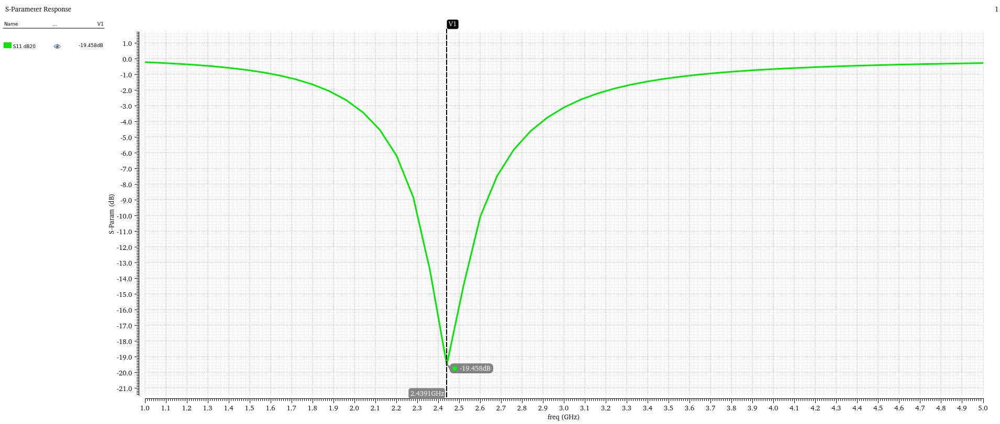
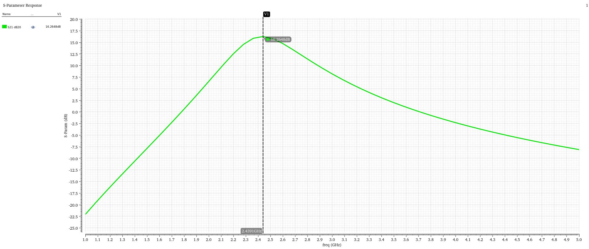
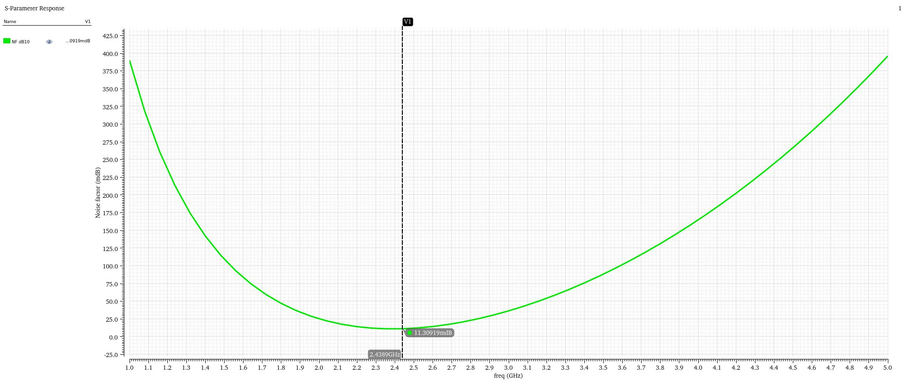
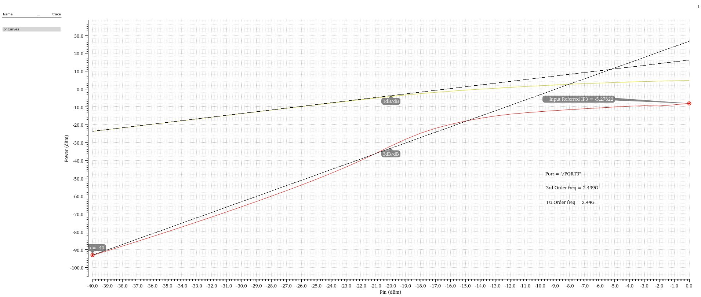
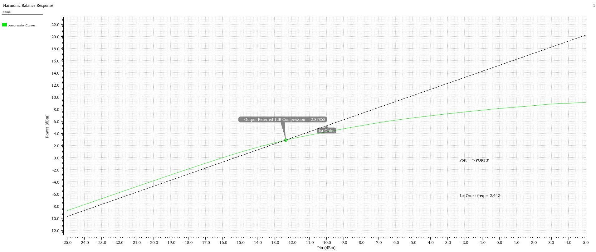
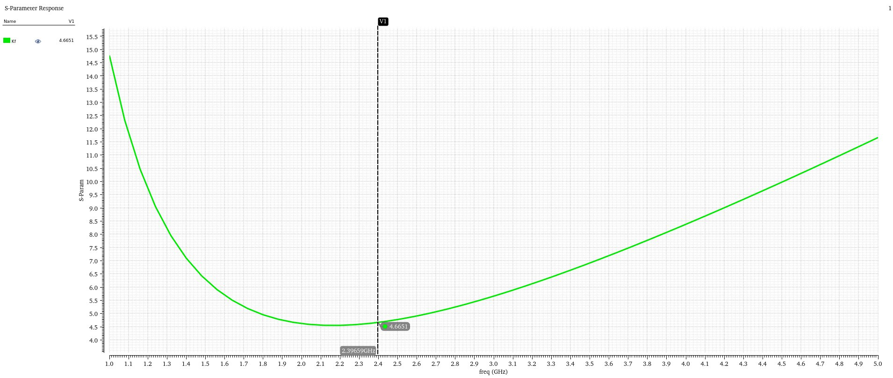
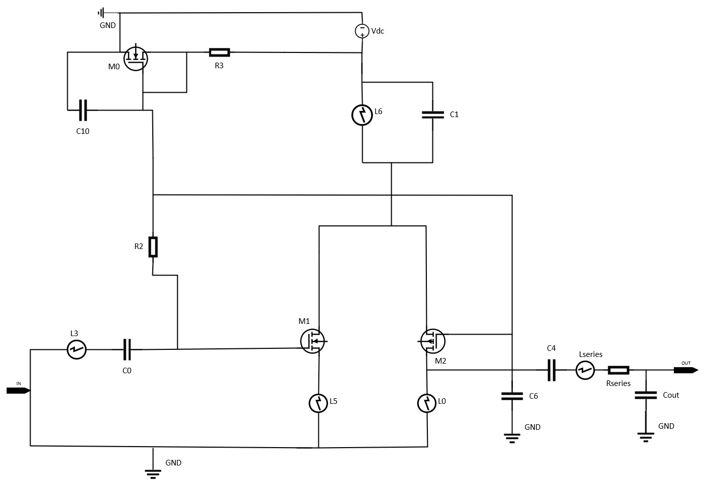
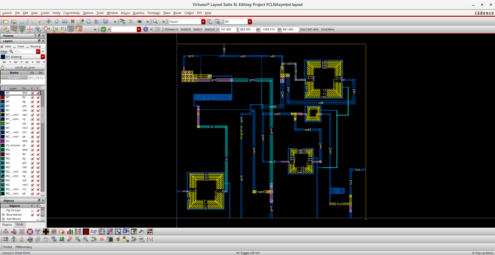
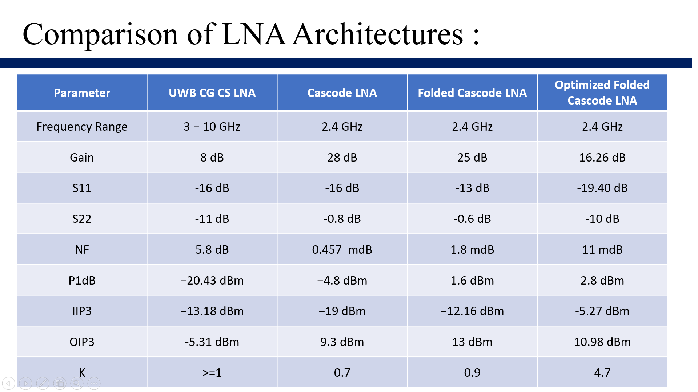

# Performance-Balanced-Noise-Canceling-Low-Noise-Amplifier

## 📌 Overview

This project focuses on the design and analysis of CMOS Low Noise Amplifiers (LNAs) for RF applications using **Cadence Virtuoso (SCL 180nm technology)**.

Multiple LNA architectures were explored to understand trade-offs between **gain, noise figure, linearity, and stability**, followed by optimization of a final design suitable for 2.4 GHz operation.

---

## 🎯 Objectives

* Design and compare multiple LNA architectures
* Improve noise performance using noise-canceling techniques
* Achieve good input/output matching (S11, S22 < -10 dB)
* Ensure RF stability (K > 1, μ > 1)
* Optimize gain-linearity trade-off

---

## 🧠 Architectures Explored

* CG-CS Noise Cancelling UWB LNA (3–10 GHz)
* Cascode LNA
* Folded Cascode LNA
* Optimized Folded Cascode LNA ✅ (Final Design)

---

## 🧩 Final Design Approach

The **folded cascode topology** was selected and optimized due to its:

* Better linearity compared to simple cascode
* Improved stability
* Balanced gain and noise performance

Further improvements included:

* Device sizing optimization
* Bias tuning
* Matching network refinement

---

## 📊 Final Results (2.4 GHz)

| Parameter     | Value          |
| ------------- | -------------- |
| Gain (S21)    | **16.26 dB**   |
| S11           | **-19.40 dB**  |
| S22           | **-10 dB**     |
| S12           | **-36.71 dB**  |
| Noise Figure  | **~1.1 dB**    |
| IIP1dB        | **-12.35 dBm** |
| P1dB (Output) | **2.87 dBm**   |
| IIP3          | **-5.27 dBm**  |
| OIP3          | **10.98 dBm**  |
| Stability (K) | **4.7 (>1)**   |

---

## 📈 Key Waveforms (Final Design)

### S-Parameters

### Noise Figure

### Linearity

### Stability

👉 Full waveform set available in `/2_Waveforms`

---

## 🧩 Circuit Schematics

### Final Optimized Design

👉 Other architectures available in `/1_Schematics`

---

## 🏗️ Layout Implementation

* Device matching and common-centroid techniques used
* Custom square spiral inductor designed (PDK limitation)

**Status:**

* Preliminary DRC/LVS checks completed
* Post-layout extraction in progress

---

## 📊 Architecture Comparison

### 🔍 Insights

* Cascode → High gain but unstable
* Folded Cascode → Better linearity
* CG-CS → Wideband, lower gain
* **Optimized Folded Cascode → Best overall trade-off ✅**

---

## 🚀 Key Contributions

* Designed and compared **4 LNA architectures**
* Implemented **noise-canceling technique**
* Achieved strong input matching (**S11 < -19 dB**)
* Ensured unconditional stability (**K = 4.7**)
* Performed layout with matching techniques
* Identified and handled real-world **PDK limitations**

---

## 🛠 Tools Used

* Cadence Virtuoso
* Spectre RF

---

## 📌 Project Status

📍 In progress toward tapeout (awaiting inductor PDK for final verification)
